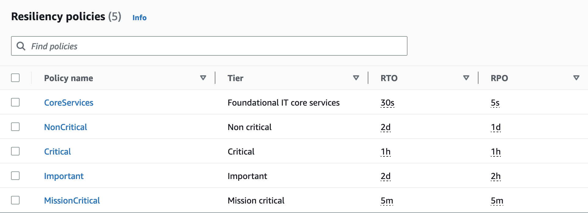
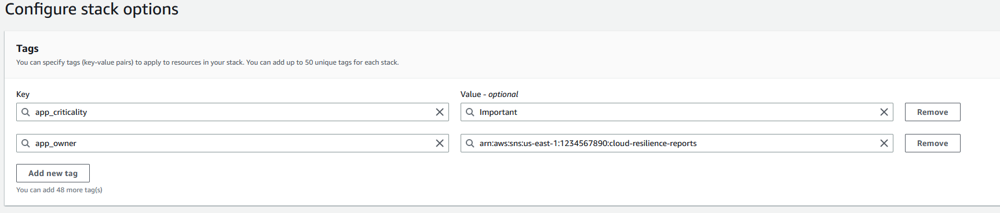
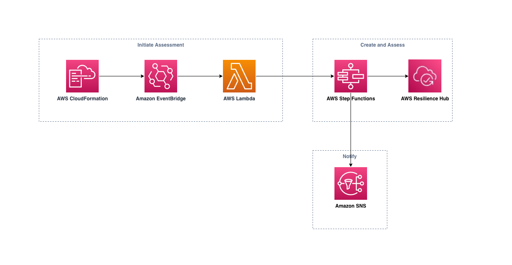

## Automate resilience assessments of your AWS CloudFormation stacks using AWS Resilience Hub and Amazon EventBridge
This AWS CloudFormation template deploys a solution to automatically assess the resilience posture of new or updated CloudFormation stacks. The solution automatically creates an application in Resilience Hub and assesses it against the provided resiliency policies. The application owner receives a notification with their resilience assessment. 

This solution uses Amazon EventBridge to launch a AWS Lambda function & AWS Step Functions workflow to orchestrate AWS Resilience Hub (ARH). The assessment result is emailed via Amazon SNS.

The solution deploys five resiliency policies in ARH to check applications against: `MissionCritical | Critical | Important | CoreServices | NonCritical` 

## Pre-reqs
1. AWS account
2. IAM admin privileges (or sufficient to deploy this solution)
3. SNS queue for receiving resilience assessment notifications

## Setup
Navigate to the CloudFormation console in AWS. Deploy `arh_cfn_eb_template.yaml`.

## How to use Solution
When deploying or updating applications to AWS using CloudFormation, add the two following tags to the CloudFormation. This will result in automatic creation or update to existing applications in ARH which notifies the application owner with the resilience assessment results.

Steps:
1. Deploy a CloudFormation template
2. During the CloudFormation deployment, add the following tags: 
    1. `app_criticality`, value: STRING from a pre-formatted list from ARH tiers: Valid Values: `MissionCritical | Critical | Important | CoreServices | NonCritical`
    2. `app_owner`, value: ARN of valid SNS Topic that will receive the resilience assessment results
   

3. Once deployed the template is deployed, the solution will automatically handle the creation/update/delete of resources in ARH.

## Reference Architecture
AWS Architecture

AWS Step Functions Workflow

The above Step Function branches based off of the status of the CloudFormation stack:
>CREATE_COMPLETE --> Create a new application in ARH
>DELETE_COMPLETE --> Delete the application in ARH
>UPDATE_COMPLETE --> Create a new version for the application in ARH and re-import input sources. If application does not exist in ARH then create a new application.

## Important Notes
- Deleting a template that was deployed with the tag will also result in the application created in ARH being deleted as well.
- To import existing stacks into ARH, update the stack and add the `app_criticality` tag.
